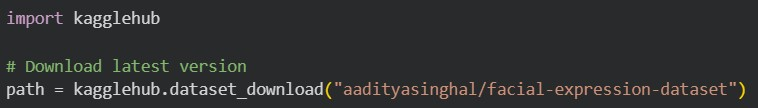
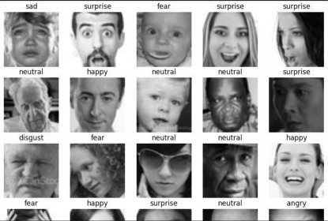
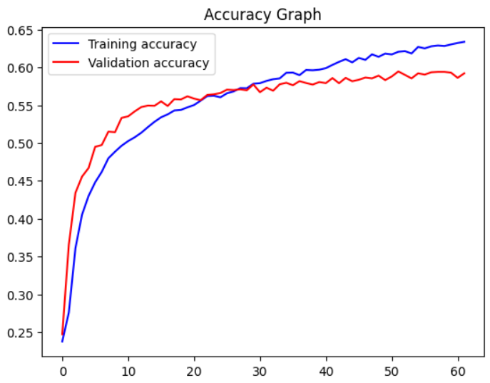
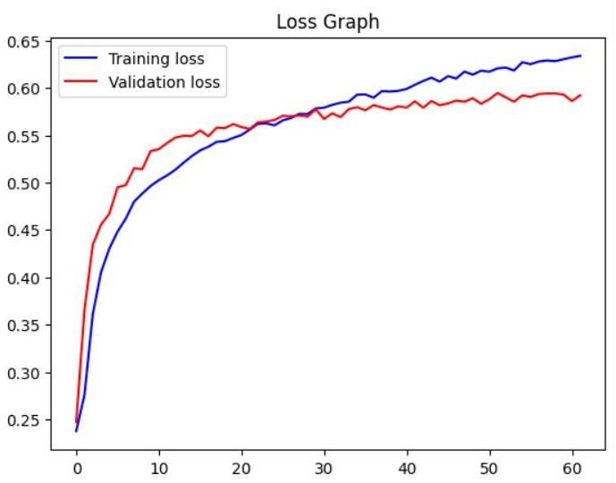
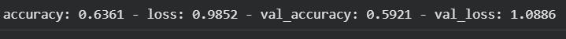

# Facial Emotion Detection Using CNN

## Overview
This project implements a Convolutional Neural Network (CNN) to classify human facial expressions into different emotion categories. The model analyzes grayscale facial images and predicts emotions such as angry, disgust, fear, happy, neutral, sad, and surprise.

The goal of this project is to explore how deep learning and computer vision techniques can be used for emotion recognition from facial images.

---

## Dataset
The model is trained using the **Facial Expression Dataset** available on Kaggle.

Dataset characteristics:
- Grayscale facial images
- Image size: **48 × 48 pixels**
- 7 emotion classes
- Separate training and testing datasets

Emotion classes:
- Angry
- Disgust
- Fear
- Happy
- Neutral
- Sad
- Surprise

---

### Test Images

---

## Technologies Used
- Python  
- TensorFlow  
- Keras  
- NumPy  
- Pandas  
- Matplotlib  
- Seaborn  

---

## Model Architecture
The CNN model consists of multiple layers designed to extract visual features and classify emotions.

Main components:
- **Convolutional Layers** for feature extraction
- **MaxPooling Layers** to reduce spatial dimensions
- **Dropout Layers** to reduce overfitting
- **Flatten Layer** to convert feature maps into vectors
- **Dense Layers** for classification
- **Softmax Output Layer** to predict probabilities for each emotion class

Training configuration:
- Optimizer: **Adam**
- Loss Function: **Categorical Crossentropy**
- Regularization: **Dropout and EarlyStopping**

---

## Training Results
The model achieved approximately **65% accuracy** on the test dataset.

### Accuracy Graph

### Loss Graph

---

## Sample Prediction
Example of the model predicting the emotion from a facial image.

---

### Accuracy

---

## How to Run the Project

1. Clone the repository
